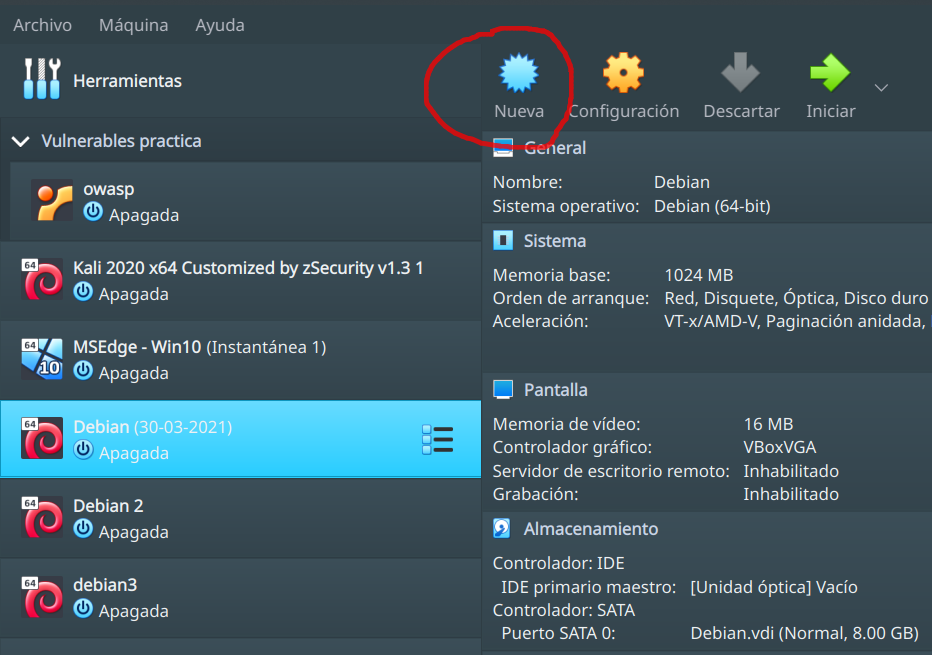

# Instalación Ubuntu Server.

En esta sección vamos a instalar Ubuntu Server 20.04 en una máquina virtual. Para esto vamos a usar el software [VirtualBox](https://www.virtualbox.org/). ¿Qué es una máquina virtual? En informática una máquina virtual es un software que emula a una computadora y puede ejecutar programas como si fuese una computadora real. 

## Descarga de Ubuntu Server 20.04.

Para instalar Ubuntu Server necesitamos un DVD o USB con la distribución de linux que queremos instalar. Estas distribuciones pueden descargarse de forma gratuita desde su respectiva pagina web. En el caso de Ubuntu Server puede descargarse desde [acá](https://ubuntu.com/download/server). En está página vamos a seleccionar "Option 2 - Manual server installation" y nos va a aparecer un botón con "Download Ubuntu Server 20.04.3 LTS", al hacer click sobre este se iniciará la descarga del archivo "ubuntu-20.04.3-live-server-amd64.iso". Como nosotros vamos a usar una máquina virtual, no es necesario que grabemos la imagen descargada en un DVD o USB, sino que vamos a trabajar directamente con el archivo iso.

## Configuración de la máquina virtual.

Para instalar Ubuntu debemos crear una máquina virtual en VirtualBox. Hacemos click en el boton "nueva", ingresamos los datos para identificarla y las caracteristicas del sistema operativo a utilizar.

Pulsamos siguiente y seleccionamos las especificaciones de nuestra máquina virtual. Estas van a depender de la capacidad del equipo con el que esten trabajando pero, al menos deberán utilizar 1 GB de memoria RAM (1024 MB). Clickeamos en siguiente y creamos el archivo que va a funcionar como disco rigido virtual. Seleccionamos la opción "Crear un disco virtual ahora" + "Crear", luego "VDI...", reservado dinámicamente + siguiente, definimos el tamaño (10 GB), el lugar donde lo vamos a guardar en nuestra computadora y clickeamos crear.

Una vez creada la máquina vamos al boton de "Configuración", a la opción almacenamiento seleccionamos la opción que dice "Vacío" bajo "Controlador IDE" y hacemos click sobre el icono del CD sobre el lado superior derecho, se despliega un menú, vamos a "Seleccionar un archivo de disco", navegamos hasta el archivo de imagen que descargamos de la página de Ubuntu + "Abrir" 

Luego vamos a la opción "Red", en "conectado a" seleccionamos "adaptador puente". Esto nos va a permitir agregar nuestra máquina virtual a la red privada sobre la que estamos trabajando, lo que nos va a permitir acceder a ella desde nuestra computadora o incluso desde otros equipos presentes en la misma red.

Con esto tenemos listo el entorno de trabajo para llevar adelante la instalación.

## Instalación.

Una vez configurada la máquina virtual vamos a proceder a la instalación del sistema operativo. Para esto, hacemos doble click sobre la máquina virtual, se va a abrir una ventana con la interfaz de la misma y se inicia el instalador con la primer pantalla, que corresponde a la selección del idioma. Para ingresar a la máquina virtual, debemos posicionar el mouse sobre la ventana (para salir debemos apretar ctrl derecho). Nos movemos por el menú con las teclas de arriba y abajo, seleccionamos Español y damos enter.

**Selección de la distribución del teclado**

De nuevo nos movemos con las teclas de flechas (arriba y abajo) y para seleccionar apretamos enter. La disposición de los teclados en Argentina suelen ser las de Español y Español latinoamericano. También se puede usar la opción de identificar el teclado, en caso de no saber cual es la distribución.

**Conexión de red**

El siguiente paso es la selección y configuración de la red. Por ahora vamos a dejar la configuración por defecto: enp0s3 y la IP asignada mediante DHCP (mas adelante vamos a ver cómo configurar una IP estatica). Para terminar seleccionamos "hecho".

**Seleccionar un proxy**

Si no es necesario acceder a internet desde un proxy dejamos la opción en blanco.

**Selección del repositorio**

Dejamos el que trae por defecto

**Configuración de almacenamiento**

En este paso debemos definir la configuración del sistema de almacenamiento. Podemos llevar a cabo la configuración de forma automática utilizando el disco completo o manual, fijando como queremos particionar el disco. Además, podemos definir si queremos utilizar un particionado tradicional o utilizar LVM (Logical Volume Management).

LVM es un conjunto de herramientas que permiten la administración de unidades de almacenamiento denominadas volúmenes lógicos. Provee flexibilidad para administrar el almacenamiento del sistema de manera que pueda expandirse fácilmente. El redimensionado de los volúmenes lógicos bajo LVM se puede realizar sin interrumpir el funcionamiento normal del equipo. Además, el procedimiento es mucho más rápido que en el particionado tradicional.

Cuando se realiza la instalación de servidores es preferible configurar el sistema de almacenamiento sobre LVM. 

Utilizamos todo el disco y LVM, y vamos a ver como está compuesta la instalación por defecto.

En la siguiente pantalla vemos distintas opciones:
- Los puntos de montaje, es decir, los puntos del sistema de archivos de linux donde se van a montar los dipositivos de almacenamiento.
- Los dispositivos disponibles para ser utilizados.
- Los dispositivos utilizados al momento.

Como puede verse en la imagen, la instalación por defecto establece 2 puntos de montaje:
- `/				8.996GB	new ext4	new LVM logical volume`
- `/boot		1.000GB	new ext4	new partition of disco local`

La primera partición forma parte del LVM y está montado en la raiz (`/`) del SO. La segunda partición no forma parte del LVM y está montada en `/boot` que es el directorio donde se encuentra el kernel de linux.

En la parte de dispositivos utilizados vemos un volume group y un logical volume que es el que se encuentra montado sobre `/`. Finalmente, podemos ver las particiones que tiene el disco, el tipo y el tamaño.
- `partition 1  new,    BIOS grub spacer                            1.0000M`
- `partition 2  new, to be formatted as ext4, mounted at /boot      1.000G`
- `partition 3  new, PV of LVM volume group ubuntu-vg               8.997G`

Vamos a la opción `ubuntu-lv	new, to be formatted as ext4, mounted at /` y presionamos "enter" o la "barra espaciadora", nos aparece un menú lateral con las opciones "(close)", "Edit" y "Delete". Vamos a "Edit", se abre una ventana que nos da la posibilidad de modificar distintos aspectos del logical volume. Acá, si modificamos el tamaño del volumen (por uno menor) nos va a aparecer espacio libre dentro del volume group, que posteriormente podemos utilizar para generar otra partición, que luego podríamos montar en algún punto de montaje del SO. Seleccionamos "Hecho" y nos aparece un cartel para indicarnos que si seguimos adelante el proceso va a destruir el contenido del disco y que dicho proceso es irreversible, ponemos "Continuar" y seguimos con la siguiente ventana.

**Configuración de perfil**

En esta ventana debemos ingresar las credenciales que nos permitirán autenticarnos en el sistema y el nombre del host. La clave ingresada tambien nos permitirá ejecutar funciones como administrador.

**Configuración de SSH**

Acá podemos seleccionar si queremos instalar o no el servidor SSH. El protocolo SSH (Secure Shell) es una herramienta que nos permite conectarnos a equipos remotos y llevar a cabo tareas dentro del mismo como si estuvieramos logueados de forma física en dicho equipo. También nos permite copiar datos de forma segura. Vamos a marcar la instalación y continuamos. 

**Instalación de paquetes**

El sistema nos ofrece la opción de instalar algunos de los paquetes más populares. Nosotros no vamos a instalar ninguno, así que salteamos esta ventana.

