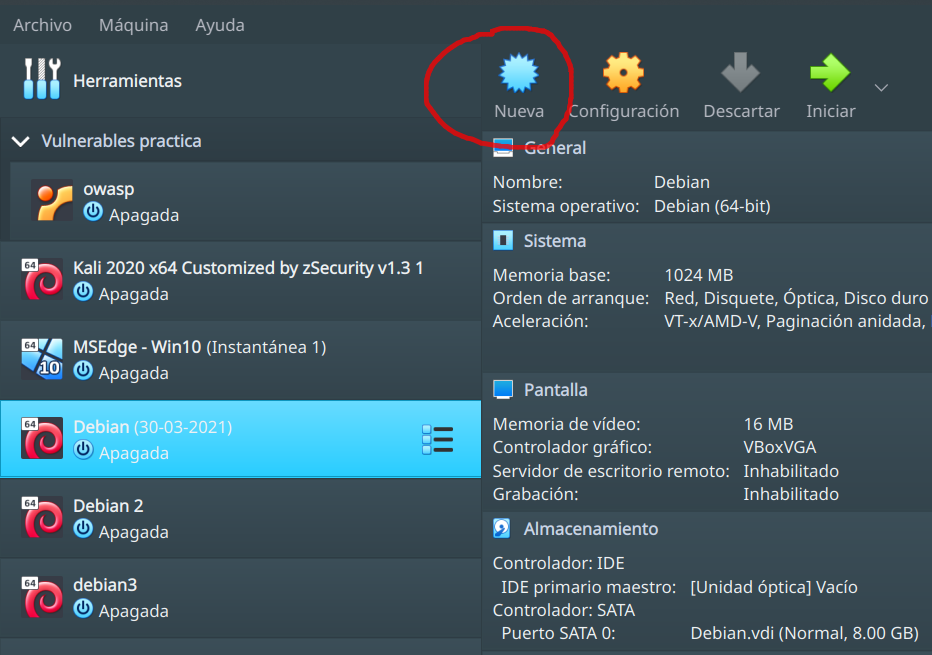
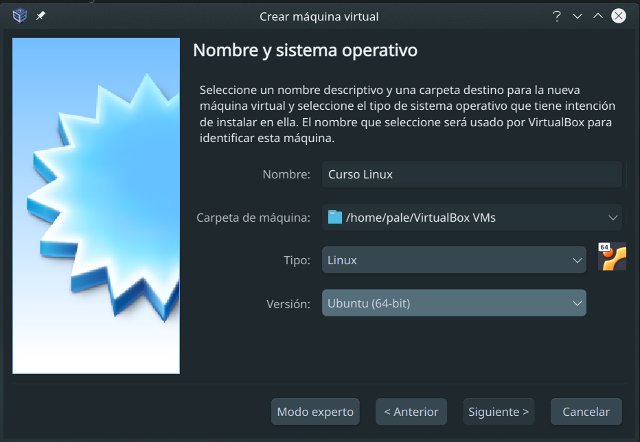
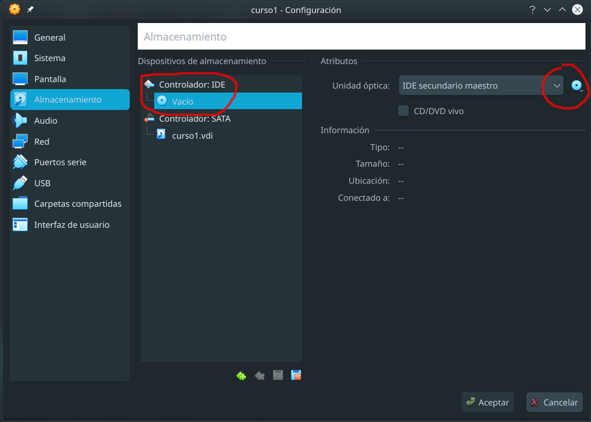
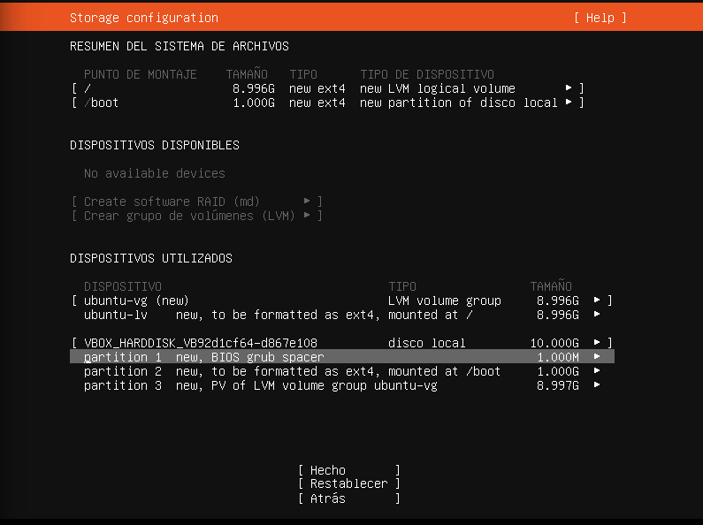
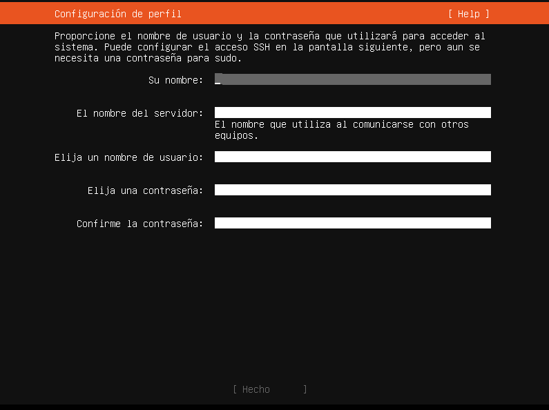

# Clase 1

- 1. Linux y distribuciones
- 2. Instalación Ubuntu server
- 3. Inicio del sistema
- 4. Comandos

# 1 - Linux y sus distribuciones
## Introducción 

Cuando decimos "Linux", en general nos referimos al sistema operativo (SO) completo pero estrictamente hablando Linux solamente es una parte del SO (el kernel), para referirnos al SO correctamente deberiamos decir GNU/Linux. El kernel o núcleo del sistema operativo es una pieza de software fundamental que se encarga de:

- Administrar el uso de los recursos del equipo.
- Facilitar la interacción entre las aplicaciones y el hardware.

Linux es uno de los sistemas operativos más populares (aunque no lo crean); su desarrollo se inició en 1991 por Linus Torvalds y se inspiró en Unix, otro sistema operativo desarrollado en la década de 1970 por AT&T Laboratories. Unix estaba orientado a pequeñas computadoras; en ese momento, las computadoras “pequeñas” se consideraban máquinas que no necesitaban una sala completa con aire acondicionado y costaban menos de un millón de dólares. Más tarde, fueron consideradas como máquinas que podían ser transportadas por dos personas. En ese momento, Unix no estaba disponible en computadoras pequeñas como las computadoras de oficina basadas en la plataforma x86. Por lo tanto, Linus, que era un estudiante en ese momento, comenzó a implementar un sistema operativo tipo Unix que se suponía que debía ejecutarse en esta plataforma.

Principalmente, Linux usa los mismos principios e ideas básicas de Unix, pero Linux en sí no contiene código Unix, ya que es un proyecto independiente. Linux no está respaldado por una compañía individual sino por una comunidad internacional de programadores. Como está disponible gratuitamente, puede ser utilizado por cualquier persona sin restricciones.

### GNU

A mediados de la década de 1980, Richard Stallman (ex-científico del Massachusetts Institute of Technology (MIT) fundó la Free Software Foundation y comenzó el Proyecto GNU (GNU's Not Unix) con la intención de crear un sistema operativo que respetara la libertad de los usuarios de usarlo, estudiarlo, modificarlo, y distribuirlo sin restricciones. Este proyecto aportó en su momento (y continúa aportando) software para las distribuciones Linux que usamos hoy en día.

De esta iniciativa también surgieron lo que hoy conocemos como las 4 libertades fundamentales del software libre:

- La libertad de ejecutar el programa como se desee, con cualquier propósito (libertad 0).
- La libertad de estudiar cómo funciona el programa, y cambiarlo para que haga lo que uno quiera (libertad 1).
- La libertad de redistribuir copias para ayudar otros (libertad 2).
- La libertad de distribuir copias de las versiones modificadas a terceros (libertad 3). 

Los esfuerzos de Linus Torvalds se vieron complementados por la iniciativa del proyecto GNU. Es decir, lo que uno tenía le faltaba al otro, y al unir el kernel desarrollado por Linus con todas las herramientas desarrolladas por el proyecto GNU se obtuvo GNU/Linux.

### Distribuciones

Una distribución de Linux es un paquete que consiste en un kernel de Linux y una selección de aplicaciones mantenidas por una empresa o comunidad de usuarios. El objetivo de una distribución es optimizar el núcleo y las aplicaciones que se ejecutan en el sistema operativo para un determinado caso de uso o grupo de usuarios. Las distribuciones a menudo incluyen herramientas específicas de distribución para la instalación de software y la administración del sistema. Es por esto que algunas distribuciones se usan principalmente para entornos de escritorio los cuales deben ser fáciles de usar, mientras que otras se usan principalmente para ejecutarse en servidores utilizando los recursos disponibles de la manera más eficiente posible.

Otra forma de clasificar las distribuciones es haciendo referencia a la distribución familiar a la que pertenecen. Las distribuciones de la familia de **Debian** utilizan el gestor de paquetes *dpkg* para gestionar el software que se ejecuta en el sistema operativo. Los paquetes que pueden instalarse con su gestor son mantenidos por miembros voluntarios de la comunidad y utilizan el formato de paquete *deb* para especificar cómo se instala el software en el sistema operativo y cómo está configurado de forma predeterminada. Al igual que una distribución, un paquete es un conjunto de software con su correspondiente configuración y documentación que facilita el proceso de instalación, actualización y uso del software.

La distribución ***Debian GNU/Linux*** es la distribución más grande de la familia Debian. El proyecto Debian GNU/Linux fue lanzado por Ian Murdock en 1993 y hoy en día miles de voluntarios están trabajando en el proyecto con el objetivo de proporcionar un sistema operativo muy fiable y promover la visión de Richard Stallman de un sistema operativo que respete las libertades del usuario para ejecutar, estudiar, distribuir y mejorar el software. Esta es la razón por la cual no proporciona ningún software propietario por defecto.

***Ubuntu*** es otra distribución basada en Debian que vale la pena mencionar. Ubuntu fue creado por Mark Shuttleworth y su equipo en 2004, con la misión de brindar un entorno de escritorio fácil de usar. La misión de Ubuntu es proporcionar software gratuito a todos en todo el mundo, así como reducir el costo de los servicios profesionales. La distribución tiene lanzamientos programados cada seis meses con un soporte a largo plazo cada 2 años.

***Red Hat*** es una distribución de Linux desarrollada y mantenida por la compañía de software con el mismo nombre, que fue adquirida por IBM en 2019. La distribución de Red Hat Linux se inició en 1994 y se renombró en 2003 a Red Hat Enterprise Linux, a menudo abreviado como RHEL. Se proporciona a las empresas como una solución empresarial confiable que es compatible con Red Hat e incluye software que tiene como objetivo facilitar el uso de Linux en entornos de servidores profesionales. Algunos de sus componentes requieren suscripciones o licencias de pago. El proyecto ***CentOS*** utiliza el código fuente disponible de Red Hat Enterprise Linux y lo compila en una distribución que está disponible de forma totalmente gratuita, sin embargo, esta distribución no tiene soporte comercial.

Tanto RHEL como CentOS están optimizados para su uso en entornos de servidor. El proyecto Fedora se fundó en 2003 y crea una distribución de Linux dirigida a computadoras de escritorio. Red Hat inició y mantiene la distribución de Fedora desde entonces. Fedora es muy progresista y adopta nuevas tecnologías muy rápidamente y a veces se considera un banco de pruebas para nuevas tecnologías que luego podrían incluirse en RHEL. Todas las distribuciones basadas en Red Hat usan el formato de paquete rpm.

La empresa SUSE fue fundada en 1992 en Alemania como un proveedor de servicios Unix. La primera versión de SUSE Linux se lanzó en 1994. A lo largo de los años, SUSE Linux se hizo conocido principalmente por su herramienta de configuración YaST. Esta herramienta permite a los administradores instalar y configurar software y hardware, así como servicios y redes. Al igual que RHEL, SUSE lanza ***SUSE Linux Enterprise Server***, que es su edición comercial. Esta distribución se publica con menos frecuencia y es adecuada para la implementación empresarial y de producción. Se distribuye como un servidor, así como un entorno de escritorio con paquetes adecuados para el propósito. En 2004, SUSE lanzó el proyecto ***openSUSE***, que abrió oportunidades para que los desarrolladores y usuarios probaran y desarrollaran aún más el sistema. La distribución de openSUSE está disponible gratuitamente para su descarga.

A lo largo de los años se han lanzado distribuciones independientes, algunas basadas en Red Hat o Ubuntu, otras diseñadas para mejorar una propiedad específica de un sistema o hardware. Otras construidas con funcionalidades específicas como ***QubesOS***, un entorno de escritorio muy seguro, o ***Kali Linux***, que proporciona un entorno para explotar las vulnerabilidades de software, utilizado principalmente por los expertos en pruebas de penetración, y otras superpequeñas distribuciones de Linux diseñadas para ejecutarse de forma específica en contenedores Linux, como Docker. También hay distribuciones creadas específicamente para componentes de sistemas embebidos e incluso dispositivos inteligentes.

[Listado de distribuciones linux](https://distrotest.net/index.php)

### Sistemas embebidos

Los sistemas embebidos son una combinación de hardware y software diseñados para tener una función específica dentro de un gran sistema. Por lo general, forman parte de otros dispositivos que ayudan a controlarlos. Los sistemas embebidos se encuentran en aplicaciones de automoción, médicas e incluso militares. Debido a su gran variedad de aplicaciones varios sistemas operativos basados en el kernel de Linux han sido desarrollados para ser utilizados en sistemas embebidos. Una parte importante de los dispositivos inteligentes tiene un sistema operativo basado en el kernel de Linux.

Por lo tanto, con los sistemas embebidos surge el software embebido. El propósito de este software es acceder al hardware y hacerlo utilizable. Entre las principales ventajas de Linux sobre cualquier software embebido propietario se encuentran, la compatibilidad de plataformas entre vendedores, el desarrollo, el soporte y la ausencia de cuotas por concepto de licencia. Dos de los proyectos de software embebido más populares son Android, que se utiliza principalmente en teléfonos móviles a través de una variedad de proveedores, y Raspbian que se utiliza principalmente en Raspberry Pi.

#### Android

Android es un sistema operativo para dispositivos móviles desarrollado principalmente por Google. Android Inc. fue fundado en 2003 en Palo Alto, California. La compañía inicialmente creó un sistema operativo destinado a funcionar en cámaras digitales. En 2005, Google adquirió Android Inc. y lo desarrolló para convertirse en uno de los mayores sistemas operativos para dispositivos móviles.

La base de Android es una versión modificada del kernel de Linux con software adicional de código abierto. El sistema operativo está desarrollado principalmente para dispositivos con pantalla táctil, pero Google ha desarrollado versiones para televisores y relojes de pulsera. Se han desarrollado diferentes versiones de Android para consolas de juegos, cámaras digitales y PCs.

El código abierto de Android está disponible gratuitamente como Android Open Source Project (AOSP). Google ofrece una serie de componentes propietarios además del núcleo de Android. Entre los componentes se incluyen aplicaciones como Google Calendar, Google Maps, Google Mail, el navegador Chrome y Google Play Store, que facilita la instalación de aplicaciones. La mayoría de los usuarios consideran estas herramientas una parte integral de su experiencia con Android. Por lo tanto, casi todos los dispositivos móviles enviados con Android a Europa y América incluyen el software patentado de Google.

Android en dispositivos integrados tiene muchas ventajas. El sistema operativo es intuitivo y fácil de usar con una interfaz gráfica de usuario, tiene una comunidad de desarrolladores muy amplia, así que es fácil encontrar ayuda para el desarrollo. También es compatible con la mayoría de los proveedores de hardware con un controlador de Android, por lo tanto, es fácil y rentable crear un prototipo para un sistema entero.

#### Raspbian y Raspberry Pi

Raspberry Pi es una computadora de bajo costo del tamaño de una tarjeta de crédito que puede funcionar como un ordenador de sobremesa con todas sus funciones, pero que a su vez puede utilizarse dentro de un sistema Linux integrado. Este ordenador fue desarrollado por la Fundación Raspberry Pi, que es una organización benéfica educativa con sede en el Reino Unido. Su principal propósito es enseñar a los jóvenes a aprender a programar y comprender la funcionalidad de las computadoras. El Raspberry Pi se puede diseñar y programar para realizar tareas u operaciones que forman parte de un sistema mucho más complejo.

Las especialidades de Raspberry Pi incluyen un conjunto de pines de Entrada/Salida de Propósito General (GPIO) que pueden ser utilizados para acoplar dispositivos electrónicos y placas de extensión, lo que permite utilizar Raspberry Pi como plataforma para el desarrollo de hardware, ya que a pesar de que estaba pensado para fines educativos se utiliza hoy en día en varios proyectos de DIY (hágalo usted mismo), así como para la creación de prototipos industriales en el desarrollo de sistemas embebidos.

La Raspberry Pi utiliza procesadores ARM. Varios sistemas operativos, incluido Linux, corren sobre Raspberry Pi. Como Raspberry Pi no contiene un disco duro, el sistema operativo se inicia desde una tarjeta de memoria SD. Una de las distribuciones de Linux más destacadas para Raspberry Pi es Raspbian. Como su nombre indica, pertenece a la familia de distribución de Debian. Está personalizado para instalarse en el hardware de Raspberry Pi y proporciona más de 35000 paquetes optimizados para este entorno. Además de Raspbian, existen muchas otras distribuciones de Linux para Raspberry Pi, como, por ejemplo, Kodi, que convierte a Raspberry Pi en un centro de medios.

### Linux y el Cloud Computing

El término cloud computing se refiere a una forma estandarizada de consumir recursos informáticos, ya sea comprándolos a un proveedor público de cloud computing o ejecutando una nube privada. Según informes del 2017, Linux ejecuta el 90% de la carga de trabajo de la nube pública. Todos los proveedores de cloud computing, desde Amazon Web Services (AWS) hasta Google Cloud Platform (GCP) ofrecen diferentes formas de trabajar con Linux. Incluso Microsoft, una empresa cuyo antiguo CEO comparó Linux con un cáncer, ofrece hoy en día máquinas virtuales basadas en Linux en su nube Azure.

Linux generalmente es ofrecido como parte de Infrastructure as a Service (IaaS). Las instancias IaaS son máquinas virtuales que se aprovisionan en cuestión de minutos en la nube. Cuando se inicia una instancia IaaS, se elige una imagen que contiene los datos que se desplegarán en la nueva instancia. Los proveedores de nube ofrecen varias imágenes que contienen instalaciones listas para ejecutar tanto de las distribuciones populares, así como sus propias versiones de Linux. El usuario podrá elegir una imagen que contiene su distribución preferida y acceder a una instancia de la nube que ejecute esta distribución poco después de haberse creado. La mayoría de los proveedores agregan herramientas a sus imágenes para ajustar la instalación a una instancia específica de la nube. Estas herramientas pueden, por ejemplo, extender los sistemas de archivos de la imagen para que se ajusten al disco duro real de la máquina virtual.

[Top 500](https://en.wikipedia.org/wiki/TOP500)

- Fuentes:
	- [Linux essentials](https://learning.lpi.org/es/learning-materials/010-160/1/1.1/1.1_01/)

# Instalación Ubuntu Server.

En esta sección vamos a instalar Ubuntu Server 20.04 en una máquina virtual. Para esto vamos a usar el software [VirtualBox](https://www.virtualbox.org/). ¿Qué es una máquina virtual? En informática una máquina virtual es un software que emula a una computadora y puede ejecutar programas como si fuese una computadora real. 

## Descarga de Ubuntu Server 20.04.

Para instalar Ubuntu Server necesitamos un DVD o USB con la distribución de linux que queremos instalar. Estas distribuciones pueden descargarse de forma gratuita desde su respectiva pagina web. En el caso de Ubuntu Server puede descargarse desde [acá](https://ubuntu.com/download/server). En está página vamos a seleccionar "Option 2 - Manual server installation" y nos va a aparecer un botón con "Download Ubuntu Server 20.04.3 LTS", al hacer click sobre este se iniciará la descarga del archivo "ubuntu-20.04.3-live-server-amd64.iso". Como nosotros vamos a usar una máquina virtual, no es necesario que grabemos la imagen descargada en un DVD o USB, sino que vamos a trabajar directamente con el archivo iso.

## Configuración de la máquina virtual.

Para instalar Ubuntu debemos crear una máquina virtual en VirtualBox. Hacemos click en el boton "nueva", ingresamos los datos para identificarla y las caracteristicas del sistema operativo a utilizar.





Pulsamos siguiente y seleccionamos las especificaciones de nuestra máquina virtual. Estas van a depender de la capacidad del equipo con el que esten trabajando pero, al menos deberán utilizar 1 GB de memoria RAM (1024 MB). Clickeamos en siguiente y creamos el archivo que va a funcionar como disco rigido virtual. Seleccionamos la opción "Crear un disco virtual ahora" + "Crear", luego "VDI...", reservado dinámicamente + siguiente, definimos el tamaño (10 GB), el lugar donde lo vamos a guardar en nuestra computadora y clickeamos crear.

Una vez creada la máquina vamos al boton de "Configuración", a la opción almacenamiento seleccionamos la opción que dice "Vacío" bajo "Controlador IDE" y hacemos click sobre el icono del CD sobre el lado superior derecho, se despliega un menú, vamos a "Seleccionar un archivo de disco", navegamos hasta el archivo de imagen que descargamos de la página de Ubuntu + "Abrir" 



Luego vamos a la opción "Red", en "conectado a" seleccionamos "adaptador puente". Esto nos va a permitir agregar nuestra máquina virtual a la red privada sobre la que estamos trabajando, lo que nos va a permitir acceder a ella desde nuestra computadora o incluso desde otros equipos presentes en la misma red.

Con esto tenemos listo el entorno de trabajo para llevar adelante la instalación.

## Instalación.

Una vez configurada la máquina virtual vamos a proceder a la instalación del sistema operativo. Para esto, hacemos doble click sobre la máquina virtual, se va a abrir una ventana con la interfaz de la misma y se inicia el instalador con la primer pantalla, que corresponde a la selección del idioma. Para ingresar a la máquina virtual, debemos posicionar el mouse sobre la ventana (para salir debemos apretar ctrl derecho). Nos movemos por el menú con las teclas de arriba y abajo, seleccionamos Español y damos enter.

**Selección de la distribución del teclado**
De nuevo nos movemos con las teclas de flechas (arriba y abajo) y para seleccionar apretamos enter. La disposición de los teclados en Argentina suelen ser las de Español y Español latinoamericano. También se puede usar la opción de identificar el teclado, en caso de no saber cual es la distribución.

**Conexión de red**
El siguiente paso es la selección y configuración de la red. Por ahora vamos a dejar la configuración por defecto: enp0s3 y la IP asignada mediante DHCP (mas adelante vamos a ver cómo configurar una IP estatica). Para terminar seleccionamos "hecho".

**Seleccionar un proxy**
Si no es necesario acceder a internet desde un proxy dejamos la opción en blanco.

**Selección del repositorio**
Dejamos el que trae por defecto

**Configuración de almacenamiento**
En este paso debemos definir la configuración del sistema de almacenamiento. Podemos llevar a cabo la configuración de forma automática utilizando el disco completo o manual, fijando como queremos particionar el disco. Además, podemos definir si queremos utilizar un particionado tradicional o utilizar LVM (Logical Volume Management).

LVM es un conjunto de herramientas que permiten la administración de unidades de almacenamiento denominadas volúmenes lógicos. Provee flexibilidad para administrar el almacenamiento del sistema de manera que pueda expandirse fácilmente. El redimensionado de los volúmenes lógicos bajo LVM se puede realizar sin interrumpir el funcionamiento normal del equipo. Además, el procedimiento es mucho más rápido que en el particionado tradicional.

Cuando se realiza la instalación de servidores es preferible configurar el sistema de almacenamiento sobre LVM. 

Utilizamos todo el disco y LVM, pero seleccionaremos la opción "Custom Storage Layout" ya que vamos a ver como está compuesta la instalación por defecto.

En la siguiente pantalla vemos distintas opciones:
- Los puntos de montaje, es decir, los puntos del sistema de archivos de linux donde se van a montar los dipositivos de almacenamiento.
- Los dispositivos disponibles para ser utilizados.
- Los dispositivos utilizados al momento.



Como puede verse en la imagen, la instalación por defecto establece 2 puntos de montaje:
- `/				8.996GB	new ext4	new LVM logical volume`
- `/boot		1.000GB	new ext4	new partition of disco local`
La primera partición forma parte del LVM y está montado en la raiz (`/`) del SO. La segunda partición no forma parte del LVM y está montada en `/boot` que es el directorio donde se encuentra el kernel de linux.

En la parte de dispositivos utilizados vemos un volume group y un logical volume que es el que se encuentra montado sobre `/`. Finalmente, podemos ver las particiones que tiene el disco, el tipo y el tamaño.
- `partition 1  new,    BIOS grub spacer                            1.0000M`
- `partition 2  new, to be formatted as ext4, mounted at /boot      1.000G`
- `partition 3  new, PV of LVM volume group ubuntu-vg               8.997G`

Vamos a la opción `ubuntu-lv	new, to be formatted as ext4, mounted at /` y presionamos "enter" o la "barra espaciadora", nos aparece un menú lateral con las opciones "(close)", "Edit" y "Delete". Vamos a "Edit", se abre una ventana que nos da la posibilidad de modificar distintos aspectos del logical volume. Acá, si modificamos el tamaño del volumen (por uno menor) nos va a aparecer espacio libre dentro del volume group, que posteriormente podemos utilizar para generar otra partición, que luego podríamos montar en algún punto de montaje del SO. Seleccionamos "Hecho" y nos aparece un cartel para indicarnos que si seguimos adelante el proceso va a destruir el contenido del disco y que dicho proceso es irreversible, ponemos "Continuar" y seguimos con la siguiente ventana.

**Configuración de perfil**



En esta ventana debemos ingresar las credenciales que nos permitirán autenticarnos en el sistema y el nombre del host. La clave ingresada tambien nos permitirá ejecutar funciones como administrador.

**Configuración de SSH**
Acá podemos seleccionar si queremos instalar o no el servidor SSH. El protocolo SSH (Secure Shell) es una herramienta que nos permite conectarnos a equipos remotos y nos permite llevar a cabo tareas dentro del mismo como si estuvieramos logueados de forma fisica en dicho equipo. También nos permite copiar datos de forma segura. Vamos a marcar la instalación y continuamos. 

**Instalación de paquetes**
El sistema nos ofrece la opción de instalar algunos de los paquetes más populares. Nosotros no vamos a instalar ninguno, así que salteamos esta ventana.

**Ahora solo queda esperar**

# Secuencia de arranque de un núcleo Linux

Aquí aprenderemos la secuencia de arranque de un sistema operativo Linux. Entender el proceso de arranque nos permite entender también mucho del hardware de la computadora, y cómo interactúa con el software, además nos brindará conocimientos para depurar el inicio del sistema y permitirnos solucionar cualquier problema relacionado.

Al encender el equipo, el BIOS (Basic Input-Output System) o UEFI (Unified Extensible Firmware Interface) llevan a cabo una revisión del hardware conocida comunmente como POST (Power-On Self Test). A continuación, se busca un gestor de arranque (en linux por lo general, GRUB) en el MBR (Master Boot Record) o en la partición EFI de un dispositivo de almacenamiento (`partition 1	new,	BIOS grub spacer	1.0000M`).

A partir de ese momento, el GRUB toma el control del proceso de inicio, que se encargará de cargar el kernel de linux. Este reconocerá y configurará los dispositivos de hardware presentes en el equipo y los preparará para su uso. En el próximo paso, el núcleo ejecutará su primer proceso, conocido como **init**. Finalmente, este último utilizará el gestor del sistema ( **systemd o Upstart** ) o los scripts de  **SysVinit** para continuar el inicio de los demás servicios. El proceso de arranque termina al presentar una interfaz de inicio de sesión, que puede ser en modo texto o gráfico.

La secuencia de arranque de Linux puede dividirse en varias etapas:

1. La **fuente de energía** de la computadora envía un OK al timer de la placa madre.
2. **Bootstrap** y el proceso de arranque del hardware.
3. El **BIOS** y el proceso de inicio.
4. El **MBR** (Master Boot Record) o **EFI** y el **GRUB**.
5. Carga de la imagen del **kernel Linux** (initrd)
6. Carga de los servicios de inicio (SysVinit, systemd, upstart, etc.)

## 1. Suministro électrico

Uno de los componentes principales de la computadora es la fuente de energía, y su principal objetivo es proveer el nivel de voltaje necesario a la placa madre y demás componentes. Este voltaje trabaja con corriente contínua (DC), por lo que la fuente también transforma la corriente alterna domiciliaria (AC) en corriente continua.

Más allá de esto, la fuente informa sobre un buen suministro eléctrico a la computadora enviando una señal acorde, POWER GOOD, a la placa madre. Si la placa madre no recibe dicha señal de la fuente todo el tiempo, a su vez enviará una señal de reset al procesador y no podrá iniciar.

## 2. Bootstrap y secuencia de arranque

El bootstrap consiste en que el procesador busque en una ROM (Read Only Memory) de la placa madre las instrucciones para arrancar. Estas instrucciones contienen un JUMP o salto a otra dirección de memoria, la del programa BIOS (Basic Input/Output System) de la placa madre.

## 3. BIOS / UEFI

Aquí comienza realmente el proceso de inicio lógico de la computadora. Una de las primeras tareas que lleva a cabo el BIOS es denominada POST (Power on Self Test). El POST realiza una serie de verificaciones dirigidas por la BIOS que permiten determinar el estado del hardware y con él, saber si la computadora puede iniciar o no.

El POST es muy importante en la secuencia de arranque, y es un paso previo a la carga del sistema operativo, ya que verifica, entre otras cosas, la placa madre, puertos de periféricos como el teclado, los discos, la integridad de la memoria, la CPU, la ROM de video, etc.

En general hay dos tipos de inicio de la computadora, Warm Start y Cold Start. El Cold Start ejecuta el POST conducido por el BIOS cuando inicia la computadora desde su estado apagado, mientras que el Warm Start no ejecuta el post, y se da cuando iniciamos la computadora presionando el botón de Reset del gabinete.

Una confusión generalizada es pensar que el BIOS y el CMOS son la misma cosa. El BIOS, como dijimos, es un componente de software almacenado en una memoria ROM. El CMOS por su parte es una pequeña memoria RAM (Random Access Memory) alojada en la placa madre. Esta memoria almacena las configuraciones que efectuemos en el programa BIOS.

No confundir tampoco esta RAM CMOS con la memoria RAM principal de la computadora.

**RAM CMOS y la persistencia**

Recordemos que una memoria ROM es persistente y no puede modificarse directamente, por lo que NO podemos modificar el BIOS, mientras que la RAM es volátil, puede modificarse, pero su contenido se pierde al perder energía eléctrica. El contenido del CMOS en general se mantiene gracias una batería que se encuentra en la placa madre.

Al quitar la pila que mantiene el CMOS se perderá información como la fecha y hora configuradas en la BIOS, o la password de acceso a la misma.

**Dispositivos de arranque**

Volviendo a la secuencia de arranque, entre las configuraciones almacenadas en el CMOS se encuentra el orden de inicio de los dispositivos de almacenamiento donde se buscará un sistema operativo al finalizar la carga del BIOS. Estos dispositivos son, por lo general:

- CD / DVD ROM
- Disco Rígido / SSD
- Dispositivos USB
- Red (PXE/iPXE)
- Disquettes / Floppy

Según el orden en el que lo hayamos configurado en el CMOS, al iniciar buscará en uno u otro dispositivo hasta encontrar uno que disponga un sistema operativo instalado utilizable.

## 4. MBR y el gestor de arranque (GRUB)

Si estamos iniciando desde un disco rígido o SSD, o USB por ejemplo, el BIOS buscará en el dispositivo, en una región de memoria denominada Boot Sector, o sector de inicio, las siguientes instrucciones a ejecutar, correspondientes al gestor de arranque del sistema operativo. De ahí en adelante ya es el sistema operativo instalado el que se encarga de continuar la secuencia de arranque.

Ese área del disco en que se encuentra el Boot Sector es el primer sector del disco, y suele denominárselo Master Boot Record, o MBR. Ese sector corresponde a solo 512 bytes y permiten iniciar la primer etapa del boot loader, o el gestor de arranque, como Grub o el viejo Lilo. De esos 512B, solo 440B se utilizan para el cargador de arranque, el resto almacena la tabla de particiones del disco.

Dicho sea de paso, podemos guardar en un archivo binario todo el MBR con un simple comando en una terminal GNU/Linux: dd. Este comando permitirá copiar un bloque de 512B del disco en un archivo que llamaremos mbr.img.

```
dd if=/dev/sda of=/tmp/mbr.img bs=512 count=1
```
En caso de usar la tabla de partición GPT, los pasos son más complejos

```
parted -ms /dev/sda print
# Formula = (128*N)+1024 N: nro de particiones
dd if=/dev/sda of=GPT_TABLE.img bs=1 count=FORMULA
```
Podemos analizar el contenido del sector de arranque con `fdisk -l /tmp/mbr.img` si la partición es MBR o con `parted -ms /dev/sda print` si es GPT

```
BYT;
/dev/sda:1000GB:scsi:512:4096:gpt:ATA HGST HTS541010A7:;
1:1049kB:274MB:273MB:fat32:EFI system partition:arranque, esp;
2:274MB:290MB:16.8MB::Microsoft reserved partition:msftres;
3:290MB:507GB:506GB:ntfs:Basic data partition:msftdata;
5:507GB:537GB:30.0GB:ext4::;
6:537GB:997GB:460GB:ext4::;
7:997GB:1000GB:2999MB:linux-swap(v1)::swap;
4:1000GB:1000GB:523MB:ntfs:Basic data partition:oculta, diag;
```

**GRUB – GRand Unified Bootloader**

El primer sector del disco, el sector 0 mencionado anteriormente, contiene lo que se denomina Stage 1, la primera etapa del cargador de arranque. 

El cargador de arranque GRUB tiene en total tres etapas o stages:

- GRUB Stage 1
- GRUB Stage 1.5
- GRUB Stage 2

Normalmente las particiones no comienzan antes del sector 63 del disco, por lo que los sectores 1-63 están vacíos (recordemos que el sector 0 contiene el MBR). Este espacio es utilizado para almacenar lo que se denomina Stage 1.5. A este espacio también se lo denomina MBR GAP.

¿Por qué es necesaria una supuesta Stage 1.5 en GRUB?

La configuración del GRUB se encuentra en el archivo /boot/grub/grub.cfg... pero este archivo está en una partición (que puede ser una partición aislada para /boot, o la misma partición donde tenemos el sistema operativo instalado).

¿Cómo puede el GRUB acceder a dicho archivo si no se ha montado la partición, ni dispone de los drivers o controladores? Puede porque estos controladores de sistema de archivos se encuentran en estos sectores, del 1 al 63.

Aquí es cuando el GRUB carga dicha configuración y nos muestra un menú en terminal donde podemos elegir qué sistema operativo iniciar. Esto corresponde con el Stage 2 del GRUB.

## 5. Cargando la imagen del kernel Linux

Una vez que elegimos un sistema operativo GNU/Linux para iniciar, el GRUB le pasa el control del arranque al sistema operativo mediante la carga de una imagen comprimida del núcleo del mismo.

De manera similar al GRUB, el kernel Linux también se carga en etapas o Stages. El kernel es quien administra la planificación de procesos, memoria, sistemas de archivos, dispositivos periféricos de E/S, mecanismos de comunicación entre procesos (IPC), e interfaces de red, entre otros.

El kernel nunca es utilizado por los usuarios, sino que representa una capa de abstracción entre el resto del sistema operativo y el hardware, monta un entorno en el que puede correr todo el resto del sistema.

El kernel es un archivo comprimido de imagen que generalmente se encuentra dentro del directorio /boot, ubicación que está configurada en el archivo de configuración del GRUB2. Básicamente es un archivo de imagen bzImage ejecutable. Su nombre característico contiene la palabra «vmlinuz«:

```
ls /boot
config-5.4.0-80-generic  initrd.img                   memtest86+.bin               System.map-5.4.0-81-generic  vmlinuz.old
config-5.4.0-81-generic  initrd.img-5.4.0-80-generic  memtest86+.elf               vmlinuz
efi                      initrd.img-5.4.0-81-generic  memtest86+_multiboot.bin     vmlinuz-5.4.0-80-generic
grub                     initrd.img.old               System.map-5.4.0-80-generic  vmlinuz-5.4.0-81-generic

```

**initrd e initramfs**

Para poder cargar el sistema operativo primero debemos cargar muchos controladores de diversos dispositivos de hardware. Por ejemplo, podríamos tener el disco configurado en RAID o LVM donde tenemos la partición raíz («/»), o podríamos disponer de varios módulos del núcleo que realicen diferentes tareas. Si toda la funcionalidad estuviera presente en el mismo kernel Linux, la imagen comprimida sería enorme!

No obstante, la imagen del núcleo necesita ser más pequeña, y por eso, entre otras cosas, se encuentra comprimida. Las funcionalidades adicionales no están presentes en dicha imagen, sino que son cargadas mediante un sistema de archivos similar al sistema raíz provisto por initrd, por lo que muchas veces a initrd se lo denomina un sistema de archivos raíz inicial.

Initrd es utilizado por el kernel antes de que se monte el sistema raíz «/» real. En general esta imagen de un sistema de archivos de inicio suele llamarse «initramfs» dentro del directorio /boot.

Una vez que se carga este «mini linux» en memoria RAM (de ahí initramfs), se procede a la verificación de hardware y controladores. Comenzando con la verificación de la arquitectura del procesador.

El kernel dirige una gran cantidad de instrucciones de hardware, y luego carga el primer proceso del sistema operativo, el proceso **init**, cuyo PID (Process ID) es el 1:

Este PID 1 no es intencional, el núcleo le da a cada proceso nuevo que se lanza un identificador incremental. En el caso de init es «1» porque es el primer proceso que se ejecuta en espacio de usuario. El proceso init se mantiene corriendo durante toda la ejecución del sistema operativo hasta que se apaga la computadora.

Luego de cargar los módulos necesarios para «levantar» los dispositivos de hardware del ordenador, comienza la carga «real» del sistema operativo: el sistema de inicio y gestor de servicios y eventos.

Aquí disponemos de varias alternativas, entre las más conocidas: SysV init, systemd, o upstart. Estos gestores se encargan de terminar el proceso de inicio y de gestionar todos los procesos de usuario.

Cada uno tiene características distintivas, y aunque hoy en día systemd es el más común (no sin controversias), existen distribuciones GNU/Linux que utilizan SysV init tales como Devuan.

Por su parte, Upstart fue introducido por primera vez en Ubuntu 6.10, pero cuando Debian migró a systemd, Ubuntu también lo hizo. Algo similar pasó con Fedora, que utilizaba upstart en su v9 para reemplazar a SysV. No obstante, Fedora 15 reemplazó a upstart por systemd también.

Dependiendo del gestor de servicios que use la distro será la forma en la que cargará los siguientes procesos. SysV trabaja con una serie de runlevels predefinidos, mientras que systemd utiliza targets con algunas equivalencias con los runlevels de SysV.

## SysVinit
Muchas distribuciones, hasta no hace mucho tiempo, utilizaban este sistema de arranque y administración. 

Utiliza scripts y niveles de ejecución para controlar el inicio, apagado y gestión de los procesos del sistema.

Contempla 5 niveles útiles de funcionamiento numerados del 1 al 5 (de ahí el nombre systemV). Ademas se suma el nivel 0 (apagado) y 6 (reinicio del sistema).Estos niveles se conocen como niveles de corrida o runlevels. 

Cada **runlevel** se ecuentra asociado a un cierto número de servicios que por defecto deben iniciarse automáticamente cuando encendemos el equipo, y que deben detenerse al reiniciarlo o apagarlo. 

El archivo /etc/inittab tiene la configuración básica como el nivel de ejecución por defecto y las acciones a tomar en determinadas situaciones.

Se definen niveles de ejecución y qué se hará en cada uno de ellos. Se invoca al script **rc** que, dependiendo de la distribución, puede estar en /etc/rc.d/ o /etc/init.d/ y se le pasa como parámetro el nivel de ejecución.

**rc** ejecuta los archivos que hay en la carpeta /etc/rcN.d/ por orden numérico (siendo N el nivel de ejecución). Estos archivos serán enlaces simbolicos que empiezan con S o K y que apuntan a scripts que están en /etc/init.d/. Los que empiezan con S se van a iniciar y los que empiezan con k se van a apagar. Ademas, despues de la primer letra van a estar seguidos de un número de 2 cifras que va a indicar la secuencia en la que se va a ejecutar el script.

### Inicio de SysV Runlevels

- Varios modelos
- Cambios de modos
- Configuración por defecto

#### Modos

Runlevels:
- 0: halt
- 1: single-user: Solo root, sin red. Se usa para arreglar cosas o modificar parametros, etc
- 2-5: Multi-users: Estos se pueden configurar para que hagan distintas cosas. Por ejemplo, en rocks el 3 es solo la terminal y el 5 levanta entorno grafico.
- 6: Reinicia la maquina.


| Nro | Debian/Ubuntu                    | CentOS/Suse        |
|-----|----------------------------------|--------------------|
| 0   | Halt                             | Halt               |
| 1   |	Single User mode                 | Single User Mode   	|
| 2   |	Full, multiuser, GUI if installed| Multi user, sin red 	|
| 3   | Nada                             | Multi user, con red	|
| 4   | Nada                             | Nada 			  			  |
| 5   | Nada                             | Multi user GUI     |
| 6   | Reboot                           | Reboot             |

#### Cambios de modos y configuración por defecto
```
runlevel  # Indica el runlevel actual
> N 5 	  # Respuesta: N: anterior (nada), 5: estado (Multi user)
telinit 3 # Cambio de runlevel (Multi user con red sin GUI)
telinit 5 # Cambio a Multi User GUI.
runlevel
> 3 5
vi /etc/inittab # Archivo de configuracion
...
id:5:initdefault: # Estado por default
...
```

#### Manejo de servicio con SysV
- `/etc/init.d/`
- service
- chkconfig

En /etc/init.d están los servicios disponibles y se manejan con el comando service.

```
service sshd start
service sshd stop
service sshd status
```

*Configuración*
```
chkconfig --list sshd # Lista como actua el servicio en cada runlevel
> sshd 0:off	1:off	2:off	3:off	4:off	5:off	6:off
chkconfig sshd on # Activa sshd en todos los niveles (no en 0, 1 y 6)
chkconfig --level 3 sshd on
```


### Inicio con SystemD

Se ejecuta un único programa que utiliza archivos de configuración para cada servicio a gestionar (a diferencia de sysV, que utiliza scripts). Los elementos que gestiona systemd se llaman unidades y pueden ser de diversos tipos: automount, device, **service**, mount, path, snapshot, socket y **target**.

Los services se agrupan en targets, donde también podemos definir el orden de ejecución y las dependencias con otros targets o services. Son los equivalentes a los runlevels de SysVinit.

Cada unidad se define en un archivo con el nombre de dicha unidad y en la extensión se indica el tipo de unidad, por ejemplo ssh.service

Ubicaciones:

- /etc/systemd/system
- /lib/systemd/system
- /usr/lib/systemd/system

Para estar seguro consultar las paginas man `man systemd.unit`

Ejemplo de archivo:

```
[Unit]
Description=System Logging Service
Requires=syslog.socket
Documentation=man:rsyslogd(8)
Documentation=http://www.rsyslog.com/doc/

[Service]
Type=notify
ExecStart=/usr/sbin/rsyslogd -n
StandardOutput=null
Restart=on-failure

[Install]
WantedBy=multi-user.target
Alias=syslog.service
```

Ejemplo target
```
#  SPDX-License-Identifier: LGPL-2.1+
#
#  This file is part of systemd.
#
#  systemd is free software; you can redistribute it and/or modify it
#  under the terms of the GNU Lesser General Public License as published by
#  the Free Software Foundation; either version 2.1 of the License, or
#  (at your option) any later version.

[Unit]
Description=Graphical Interface
Documentation=man:systemd.special(7)
Requires=multi-user.target
Wants=display-manager.service
Conflicts=rescue.service rescue.target
After=multi-user.target rescue.service rescue.target display-manager.service
AllowIsolate=yes
```

- Varios modos
- Cambios de modos
- Configuración por defecto

| Runlevel | Boot Target |
|----------|-------------|
| 0        | poweroff    |
| 1		   | rescue      |
| 2        | multi-user  |
| 3        | graphical   |
| 5        | reboot      |

*Ver estado*
```
systemctl get-default
> graphical.target
```

*Cambiar estado por defecto*
```
systemctl set-default multi-user.target
```
luego de reiniciar, cambia el modo

*Cambiar estado*
```
systemctl isolate multi-user
```


#### Manejo de servicios con systemD
- systemctl
	- enable / disable
	- start / stop / restart / status

A diferencia de SysV, los achivos de configuración de systemD no se encuentran en un solo lugar. Esto hace muy engorrosa la administración de servicios.

*Manejo de servicios*
```
systemctl status sshd
systemctl start <servicio>
systemctl stop <servicio>
systemctl enable <servicio>
systemctl disable <servicio>
```

## Filesystem Hierarchy Standard

En Linux todos los directorios se ubican en forma de árbol invertido con un origen común. Este primer directorio se denomina raíz o root (/) y contiene al resto de los directorios y archivos de manera organizada.

Esta distribución de los directorios está estandarizada en un documento denominado **Filesystem Hierarchy Standard**. Donde se detalla el proposito de los directorios en un sistema Linux.


En el siguiente nivel hacia abajo podemos encontrar directorios como:
- /bin/: contiene los archivos ejecutables correspondientes a los comandos que todos los usuarios del sistema pueden utilizar
- /boot/: Contiene archivos necesarios para el arranque del sistema (incluyendo el propio kernel).
- /dev/: Aparecen dispositivos presentes en el sistema. Por ejemplo:
    - Representaciones de discos:
       - /dev/sda: Primer disco
        - /dev/sdb: Segundo disco
        - /dev/sdc: Tercer disco
    - Representaciones de particiones:
        - /dev/sda1: primer partición del primer disco
        - /dev/sda2: segunda partición del primer disco
- /home/: Es el directorio donde se alojan los directorios personales de los usuarios del sistema
- /root/: Es el directorio personal del usuario root o superusuario (es el usuario con privilegios ilimitados)
- /sbin/: Ejecutables correspondientes a utilidades del sistema.
- /usr/: Contiene comandos accesibles para los usuarios, aunque es de solo lectura. Es decir, son archivos que los usuarios sin privilegios no pueden modificar
- /var/: Contiene subdirectorios y archivos variables, sujetos a cambios permanentes (registros de logs del sistema o del funcionamiento de procesos)
- /tmp/: Es una ubicación especial en la que los distintos programas pueden escribir y leer archivos temporales. Es posible que el contenido de este directorio se borre al reiniciar el sistema.
- /etc/: Este directorio contiene los archivos de configuración del sistema y de las aplicaciones instaladas.

Hay otros directorios y subdirectorios, pero estos serian los más importantes para entender el funcionamiento del sistema.

- Fuentes:
	- [Secuencia de arranque de un núcleo Linux](https://juncotic.com/secuencia-de-arranque-linux/)
	- Carrera linux - Curso operador linux

# Comandos

Una vez finalizada la instalación, el equipo se reinicia y nos va a aparecer la ventana de login, para ingresar debemos colocar el nombre de usuario y la contraseña que colocamos durante la instalación. Esta ventana es lo que se denomina terminal o tty que es el espacio donde podemos escribir los comandos y ver los resultados de los mismos. Linux cuenta con 5 terminales tty1 a tty6 a las que se accede con las teclas Alt+Ctrl+F1-6. Si nos conectamos por un entorno gráfico, podemos acceder a esta interfaz mediante un programa denominado pseudo terminal o pts. 

Una vez logueados, el sistema operativo nos devuelve el prompt, o línea de comandos, lista para recibir nuestras ordenes. En el caso de Ubuntu el prompt inicial está compuesto por dos partes:

- El nombre del usuario actual, seguido del símbolo @.
- El nombre del equipo.


Por defecto, al loguearnos el sistema nos lleva a la carpeta personal, que está ubicada en /home/usuario. Aquí es donde el usuario puede guardar sus archivos y directorios. El símbolo ~ se utiliza para representar este directorio. Si estamos logueados como root, veremos el símbolo #, en cambio, si lo hacemos como un usuario común se mostrará el signo $.

Además de su directorio personal, cada usuario tiene asignado un interprete de comandos o shell. Se trata de un programa que se encarga de recibir las ordenes o comandos que este escribe y las envía al sistema operativo para ejecutarlas. El shell por defecto en la mayoria de las distribuciones es **bash** (Bourne-Again SHell). Bash también nos permite escribir y ejecutar scripts ya que es un lenguaje de programación.

Antes de empezar con los comandos, vamos a quitar la función cloud-init que viene por defecto en el SO y que suele enviar notificaciones a la pantalla que pueden ser molestas. Para esto ejecutamos:

```
sudo touch /etc/cloud/cloud-init.disabled
sudo dpkg-reconfigure cloud-init
```

También vamos a agregar este repositorio a nuestro directorio personal para poder navegar por él, ya que este último está vacio.
```
git clone https://github.com/Pale24/wiki-linux/
```
Git es un software de control de versiones diseñado por Linus Torvalds.

A continuación vamos a ver algunos de los comandos mas comunes y que nos van a permitir navegar e interactuar con el sistema.

## pwd
Muestra el directorio donde estamos parados dentro del sistema de archivos.

## cd
Change directory. Cambia de directorios. Utilizamos el comando cd seguido de la ubicación a la que deseamos movernos. Las ubicaciones las podemos ingresar de forma relativa a nuestra ubicación actual o de forma absoluta desde el directorio raíz (/).

```
cd                              # Nos lleva al directorio por defecto del usuario con el que estamos logueados. /home/usuario
cd ~                            # Idem anterior "~" simboliza al directorio del usuario
cd .                            # Nos lleva al mismo directorio en el que estamos. Para linux "." indica el directorio actual
cd ..                           # Nos lleva al directorio anterior en el arbol de directorios. Si estamos en /home/usuario -> /home
cd /                            # Nos lleva al directorio raiz 
cd Documentos                   # Nos lleva al directorio Documentos (que está dentro del directorio actual). Ruta relativa
cd /home/usuario/Documentos     # Nos lleva al directorio /home/usuario/Documentos. Ruta absoluta
cd wiki-linux
```

## ls
Muestra el contenido de un directorio.

Permite distinguir los siguientes tipos de contenidos en un directorio. Si el argumento representa un archivo, enlace simbólico, dispositivo, etc., veremos datos sobre el mismo en la salida de ls.

- En blanco (en el caso de que el color de fondo de la terminal sea negro u otro color oscuro, que es lo más común), los archivos de texto o binarios no ejecutables.
- En verde, los archivos de texto (scripts) y otros binarios ejecutables.
- En celeste, los enlaces simbólicos.
- En fondo negro con letras rojas, los enlaces simbólicos rotos. Nos referimos a aquellos que apunten a un recurso del sistema que no existe.
- En amarillo, los dispositivos de bloques.
- En violeta, los archivos de imágenes o archivos temporales.
- En rojo, los archivos comprimidos.


```
ls              # Lista el contenido de la carpeta actual
ls carpeta      # Lista el contenido de la carpeta "carpeta"
ls -l           # Lista el contenido como una lista en vez de solo los nombre 
                # y pone información adicional como permisos, propietario (usuario y grupo),
                # tamaño, fecha de modificación.
ls -lh          # Idem -l pero el tamaño es más legible (no está en bits sino en Kb, Mb, etc)
ls -lS          # Ordena por tamaño (mayor a menor)
ls -lSr         # Ordena por tamaño (menor a mayor), r: invierte el orden
ls -lt          # Ordena por fecha de modificación, r: invierte el orden
ls -a           # Muestra archivos ocultos
ls -lR			# Muestra el contenido de forma recursiva (contenido de los directorios que estan dentro de la carpeta)
```

Al listar con el modificador -l obtenemos mayor información de los archivos y directorios. La salida del comando en este caso está dispuesta en columnas para que nos resulte más sencillo reconocerla. A continuación vemos cómo queda cada columna:

`-rw-rw-r-- 1 pale pale 1710 sep 22 13:21 amber20.md`

- 1. El primer caracter que aparece en la primera columna indica si lo que estamos viendo es un archivo (-), un directorio (d), un enlace simbólico (l) por nombrar algunos ejemplos. A continuación, vemos los permisos que poseen sobre el mismo a) el dueño del archivo, b) el grupo dueño, y c) el resto de los usuarios del sistema.
- 2. Esta columna nos dice si este objeto posee enlaces que lo estén apuntando.
- 3. Usuario dueño del objeto.
- 4. Grupo dueño del objeto.
- 5. Tamaño en bytes del objeto. Para mostrar este dato en una unidad más amigable (KB, MB, etc.) podemos agregar la opción -h.
- 6. Fecha de última modificación del objeto.

## mkdir

Crea directorios

```
mkdir dir1
# crear directorio y sus directorios padres (si no existen)
mkdir -p dir1/dir2/dir3
```

## cat
Puede visualizar y concatenar archivos de texto. Se suele usar para mostrar su contenido por pantalla
```
cat archivo.txt 
cat -n archivo.txt # muestra el numero de linea antes de cada una de estas
```

## more
Muestra el texto poco a poco, con el espacio avanzamos una pantalla, con el intro una linea, con la q salimos y la h nos muestra ayuda.

## less
Parecido a more, pero más potente. Acepta los controles mencionados y también puede realizar búsquedas o modificaciones en los ficheros. Recomendable para ficheros muy grandes.

## head
Muestra las N primeras líneas de uno o varios ficheros de texto. Por defecto las 10 primeras

- -n: cambia la cantidad de lineas a mostrar
- -q: no muestra el nombre de los ficheros si se le pasan varios al mismo tiempo

## tail 
Igual que head pero muestra las últimas lineas
- -f: muestra las ultimas lineas de forma interativa

## touch 
Actualiza el tiempo de acceso y modificación de un archivo al tiempo actual. Si el archivo no existe lo crea vacio.
```
touch file
```

## nano	
Editor de texto
```
nano file
```
Si el archivo no existe, lo crea. Las opciones pueden verse en el menú inferior de la ventana del navegador.

## vi/vim 

```
vi file
```

Al invocar a vi seguido del nombre de un archivo, lo crea si no existe. En la pantalla aparecerá la posición actual del cursor resaltada, las líneas en blanco indicadas con el símbolo ~, y en la parte inferior la línea de estado. En este sector se mostrará el nombre del archivo y el número de caracteres que contiene.

Existen dos modos de operación en el vi:
- Modo entrada: Se usa para añadir texto al archivo.
- Modo comando: Es el modo de operación por defecto. Se usa para introducir comandos que realizan funciones específicas del editor.

Cuando se abre por primera vez un archivo, vi siempre se encuentra en modo comando. Por esa razón, antes de poder escribir texto en el archivo se necesita presionar una de las teclas que habilitan el modo entrada:
- i (insert), para insertar texto en la posición actual del cursor.
- a (append) para insertar texto después de la posición actual del cursor.

Ahora podemos empezar a escribir sobre el archivo. Para grabar nuestro trabajo sin salir del vi basta pulsar la secuencia:

```
Esc :w [ENTER]
```
Para salir cuando no se han hecho modificaciones:
```
Esc :q [ENTER]
```

Para salir cuando se han hecho modificaciones:

Si queremos descartar: 
```
Esc :q! [ENTER]
```

Si queremos guardar los cambios: 
```
Esc :wq [ENTER]
```

## cp
copia archivos
```
cp file1 file2			# copia file1 a file2 en el mismo directorio
cp file1 dir1/file2		# copia file1 a dir1 con otro nombre
cp -i file1 file2		# copia file1 a file2 y pregunta al usuario si desea sobreescribir 
cp -p file1 file2		# copia file1 a file2 preservando los permisos, grupo y dueño al copiar
cp -v file1 file2		# modo verbose (da más información de lo que esta haciendo)
cp -r dir1 dir2/		# copia en forma recursiva dir1 en dir2
# copia muchos archivos y directorios de origen en uno de entrada
cp -r file1 file2 dir1 dir2 destination_directory/	
cp {file1, file2, file3} directorio_destino/
```

## mv
```
mv file1 file2 			# renombrar el archivo
mv file1 dir1/			# mueve file1 a dir1
mv -i file1 dir1/		# pregunta si queremos sobreescribir file2
mv -n file1 dir1/		# previene que se sobreescriba un archivo
mv -u file1 dir1/		# mueve file1 solo si el origen es nuevo respecto al destino o si no existe en el destino
mv file1 dir1/file2		# mueve file1 a dir1/file2
# mueve todos los archivos y carpetas de origen a destino
mv file1 file2 dir1/ dir2/ destino/
```

## rm
Elimina objetos
```
rm file1			# elimina file1
rm -v file1			# modo verboso
rm -r dir1/			# elimina dir1 y su contenido
rm -rf dir1/		# elimina dir1 y su contenido sin imprimir salida
rm -ri file1 dir1/	# elimina file1 y dir1 pidiendo confirmación
```

## shred
Elimina de forma segura
```
shred -vu -n 100 file1 # 100 ciclos de sobreescritura
```

## rmdir
Elimina directorios vacios

## stat

```
stat file
```
La información que se puede obtener de stat es:

- Fichero: El nombre del fichero (en linux todo es un fichero, directorios, dispositivos, etc). Usualmente, es el nombre que se le pasa al comando pero puede cambiar si le pasamos un enlace simbolico.
- Tamaño: El tamaño del archivo en bytes.
- Bloques: El numero de bloques del sistema de archivos requeridos para ser almacenados en el disco.
- Bloques E/S: Tamaño del bloque.
- Tipo de archivo: El tipo de objeto. Los más comunes son archivos y directorios, pero también pueden ser links, sockets, etc.
- Dispositivo: El número de dispositivo en hexadecimal y decimal. Es el ID del disco donde está almacenado el archivo.
- Inode: Número de inodo. Esto es el número del objeto en una base de datos. Cada inodo identifica a un archivo.
- Enlaces: Este número indica la cantidad de enlaces duros que apuntan al archivo. Cada archivo se identifica por un inodo. Sin embargo, en linux podemos crear enlaces duros, que son archivos que apuntan al mismo inodo, por lo que si eliminamos uno de los archivos ahora el inodo queda disponible para el otro. Cada vez que se crea un enlace duro este número crece y cuando se elimina decrece. Si el número es igual a cero, el inodo se elimina. Si se usa co un directorio este número representa la cantidad de archivos en el directorio, incluyendo "." y ".." que son archivos que representan al propio directorio y al directorio padre respectivamente.
- Accesso: Indica los permisos de acceso en notación octal y tradicional rwx (read, write, executs).
- Uid: User ID y nombre de la cuenta del usuario dueño.
- Gid: Group ID y nombre del grupo dueño.
- Accesso: Fecha del último acceso al archivo.
- Modificación: Fecha de la última modificación del contenido del archivo.
- Cambio: Fecha del último cambio del archivo. Esto implica el cambio del contenido o de los atributos (por ejemplo, cambiar los permisos). En el caso de cambiar los atributos, el tiempo de modificación no se altera.
- Creación: Reservado para ver la fecha original de creación del archivo, pero no se implementa en linux.


## sudo
El comando sudo permite a los usuarios no root ejecutar comandos que normalmente requerirían privilegios de superusuario. Se antepone al comando que se quiere ejecutar como administrador. También permite cambiar de usuario. Sólo los usuarios que se encuentran en el grupo sudo pueden hacer uso de este comando.

## lspci
Muestra información sobre los buses PCI y los dispositivos que tienen conectados.
- "-v": Amplia la información. "-vv": más detalles
- "-s": Muestra información sólo del dispositivo seleccionado.

## lsusb
Muestra información sobre los buses y dispositivos usb conectados.
- "-v", "-vv" y "-s" igual a lspci
- "-t": muestra información en árbol y la velocidad del puerto

## history
Podemos buscar instrucciones que hayamos usado anteriormente con la tecla de la flecha para arriba (también se puede bajar con la tecla de abajo). Una vez que encontramos la instrucción que queremos, podemos ejecutarla o modificarla.

Tambén podemos buscar la instrucción combinando las teclas ctrl + r y entonces puedo empezar a buscar poniendo las palabras que creo que tenia y cuando la encuentro la selecciono. Si la que sale no es la que busco puedo volver a tipear ctrl + r y voy viendo las opciones.

El comando history nos abre un listado de instrucciones anteriores, para seleccionar una de ellas rapido podemos ingresar !numero de la orden. Por ejemplo !1000.

## echo

Muestra el texto que recibe.

Opciones:
- -e: Interpreta los caracteres especiales después de \ `echo -e "Hola \nMundo"` Sin el -e se interpreta de forma literal
- Al poner comillas dobles interpreta las variables del sistema que estan adentro. Si uso comillas simples esto no pasa.

## type

El intérprete de comandos BASH tiene comandos internos y otros que son ficheros ejecutables externos. Podemos usar la orden **type** seguido del nombre del comando para saber a qué categoría pertenece dicho comando.

```
type cd 
cd es una orden interna del intérprete de ordenes
type find
find is /usr/bin/find
```

## which
El comando which muestra la ruta absoluta del programa que le indiquemos.

```
which python
/usr/bin/python
```

## man

Muestra ayuda de comandos, ficheros de configuración, etc

## uname

Muestra información sobre el S.O. (sin parámetros sólo el ombre). -a muestra toda la información.

```
uname
Linux
uname -a
Linux r2-d2 5.4.0-88-generic #99-Ubuntu SMP Thu Sep 23 17:29:00 UTC 2021 x86_64 x86_64 x86_64 GNU/Linux
```

## set
Muestra o modifica la configuración de nuestro entorno. Sin parámetros visualiza variables del sistema y con -o una lista de las opciones y sus estados. (con -o opción activamos y con +o desactivamos).

## export
Crea o modifica variables de entorno.

Ejemplo: `export NOMBRE=Pablo`

## unset
Elimina una variable del entorno.

Ejemplo: unset NOMBRE

## env
Sin parámetros muestra las variables de entorno. Lo podemos usar para ejecutar un comando modificando el valor de variables de entorno.

Ejemplo: `env PATH=/new/path /bin/bash`

## Apagado

Desde el terminal podemos enviar comandos para apagar o reiniciar el sistema:

- shutdown: apaga el sistema de forma planificada
- halt: apaga el sistema sin enviar señal ACPI de apagado de alimentación electrica (apaga solo el software - SO -)
- poweroff: apaga el sistema con señal ACPI 
- reboot: reinicia el sistema


| Acción            |            |               |                 |
|-------------------|------------|---------------|-----------------|
| Reiniciar         | `reboot`   | `shutdown -r` | `halt --reboot` |
| Cerrar el sistema | `halt`     | `shutdown -h` | `reboot --halt` |
| Apagar            | `poweroff` | `shutdown -P` | `halt -p`       |

## Ejemplos:

```
man halt # info de halt, poweroff y reboot
man shutdown # solo info de shutdown
whereis halt
# Resultado
# halt: /sbin/halt /usr/share/man/man8/halt.8.gz
ls -l /sbin/halt
# lrwxrwxrwx 1 root root 14 jul 21 16:00 /sbin/halt -> /bin/systemctl
ls -l /sbin/ | grep systemctl
# lrwxrwxrwx 1 root root        14 jul 21 16:00 halt -> /bin/systemctl
# lrwxrwxrwx 1 root root        14 jul 21 16:00 poweroff -> /bin/systemctl
# lrwxrwxrwx 1 root root        14 jul 21 16:00 reboot -> /bin/systemctl
# lrwxrwxrwx 1 root root        14 jul 21 16:00 runlevel -> /bin/systemctl
# lrwxrwxrwx 1 root root        14 jul 21 16:00 shutdown -> /bin/systemctl
# lrwxrwxrwx 1 root root        14 jul 21 16:00 telinit -> /bin/systemctl

halt # Cierra el sistema pero no lo apaga
# System halted
shutdown +5 "El sistema se apagará en 5 min"
shutdown -c # cancela la orden anterior con shutdown
```
shutdown [opción] TIEMPO [mensaje]

Opciones:
- -c: cancela una orden programada de shutdown
- -k: envía mensajes pero no apaga

El tiempo puede expresarse en horas y minutos (HH:MM), el tiempo en minutos que faltan para el apagado: +M o con la palabra **now**

